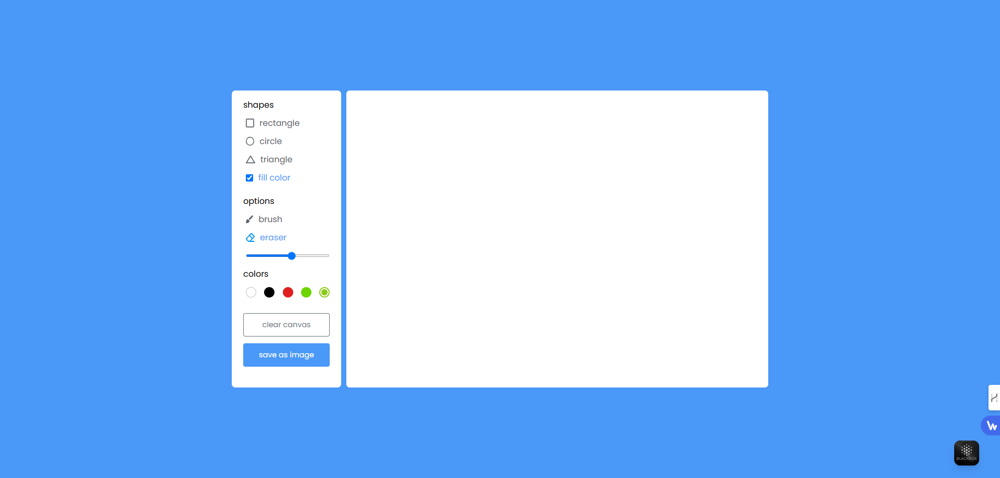
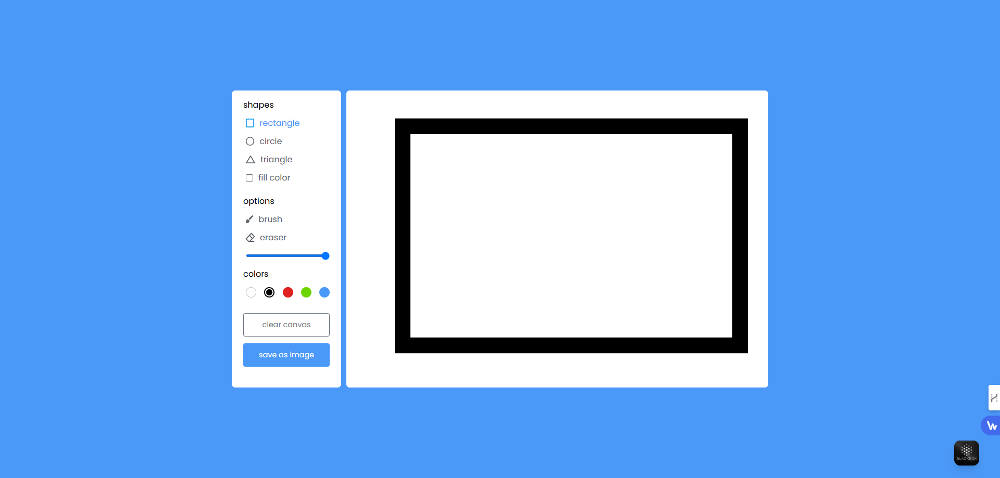
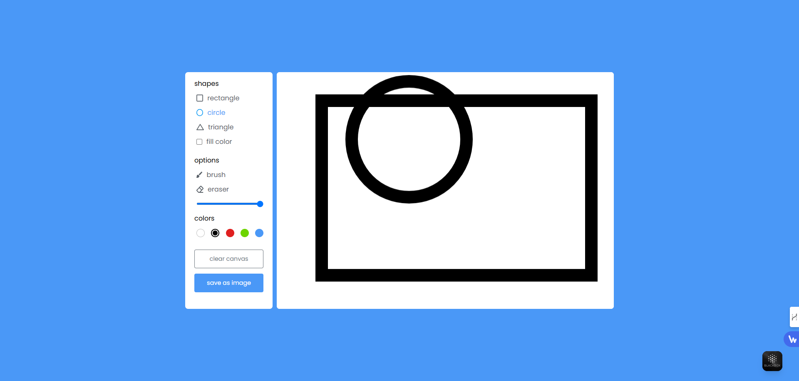
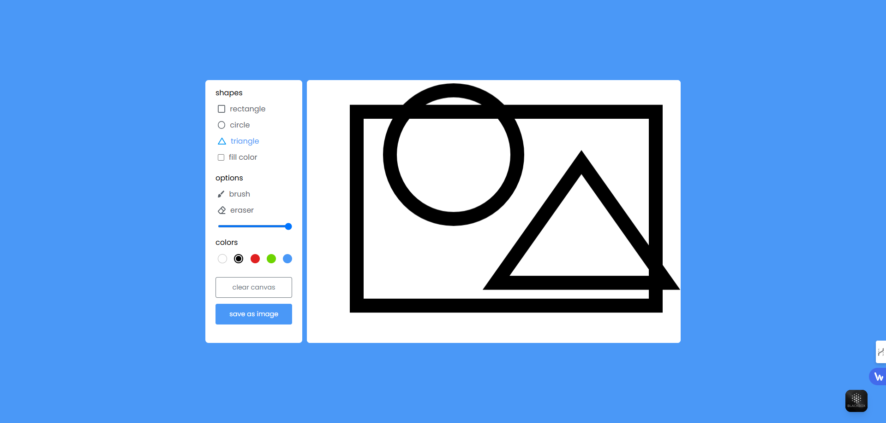
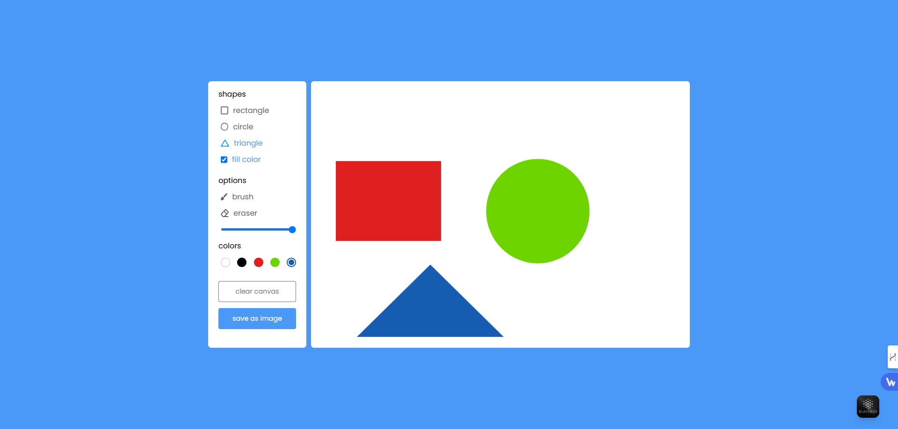
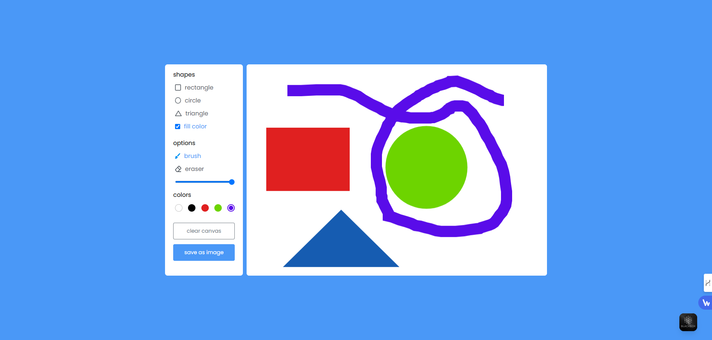
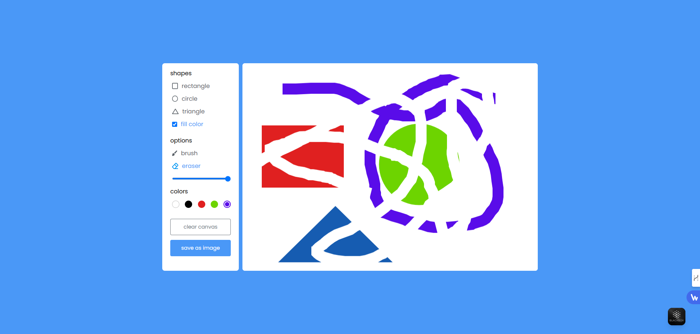

# Drawing Application

A lightweight, elegant drawing application built with HTML Canvas API and JavaScript getContext() method. This application provides an intuitive interface for creating very basic artwork without any external dependencies or libraries.

# Overview

This is a nice-looking, elegant, and very simple web-based drawing application built with core web dev technologies. It uses no extra packages, dependencies, or web APIs, offering a minimal yet functional experience. Users can draw on a canvas using their mouse with few options to change the drawing color and clear the canvas.

# Technologies Used

- HTML
- CSS
- JavaScript (No Web APIs)

# Features

- Shapes(rectangle,circle,triangle) to select type of drawing shape.
- Fill color to draw shape with colors based on selected color.
- Brush to draw art on hand using mouse. Also based on selected color.
- Eraser to clean unwanted art or part on canvas board.
- Slider range to increase or decrese stroke size.
- Click clear canvas to reset the canvas board.
- Click save as image to download drawing art as image format.

## Installation
To run the application locally:

1. **Clone the Repository**
 
   ```bash
   git clone https://github.com/your-username/Drawing-Application.git
   ```
2. **Navigate to the Folder**
  
   ```bash
   cd Drawing-Application
   ```
3. **Open the Project Folder**

   Open ```index.html``` file in your preferred web browser.

# Usage

1. Select Shapes(rectangle,circle,triangle) to draw shapes.
2. Select fill color to draw shapes with colors based on selected colors.
3. Choose a color using the color picker.
4. Draw on the canvas board with your mouse.
5. Use the brush to draw art on hand using mouse.
6. Use the eraser to remove unwanted parts.
7. Clear the canvas if you want to start over.
8. Click the save as image to download your artwork as a ```.jpg``` file.

# screenshots









# Contributing

Contributions are welcome! If you'd like to improve this application:

1. Fork the repository.
2. Create your feature branch ```git checkout -b 'feature/Amazing-Feature'```.
3. Commit your changes ```git commit -m 'Add some amazing feature'```.
4. Push to the branch ```git push origin 'feature/Amazing-Feature'```.
5. Open a Pull Request.
